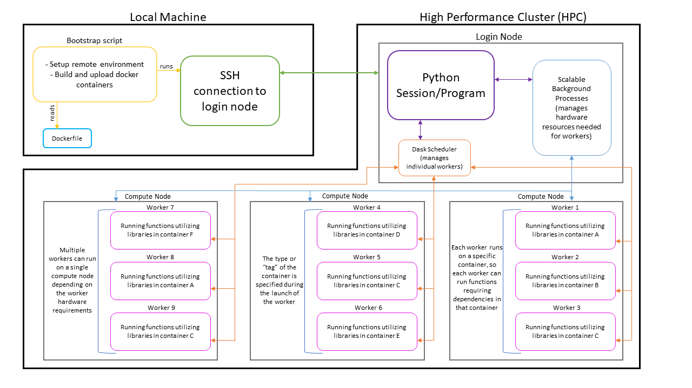

.. Scalable documentation master file, created by
   sphinx-quickstart on Thu Aug 22 10:55:42 2024.
   You can adapt this file completely to your liking, but it should at least
   contain the root `toctree` directive.

Scalable Documentation
======================

Scalable is a Python library for running complex workflows on HPC systems
efficiently and with minimal manual intervention. It uses a dask backend and a 
range of custom programs to achieve this. The figure below shows the general 
architecture of Scalable.

These questions can help answering if Scalable would be useful for you:

* Is your workflow ran on a HPC system and takes a significant amount of time?
* Does your workflow involve pipelines, where outputs from certain functions or 
  models are passed as inputs to other functions or models?
* Do you want the hardware allocation to be done automatically?

Scalable could be useful if one of more of the above questions are affirmative.
To incorporate the ability to run functions under different environments, 
docker containers can be used. A Dockerfile with multiple targets can be used
to make multiple containers, each with different installed libraries and models.
When adding workers to cluster, it can be specified how many workers of
each type should be added.

Contents:
---------

.. toctree::
   :caption: Getting Started
   :maxdepth: 1

   getting_started

.. _api_section:

.. toctree::
   :caption: API
   :maxdepth: 1

   workers
   caching
   functions

.. _how_tos_section:

.. toctree::
   :caption: How-tos
   :maxdepth: 1

   cache_hash
   container
   rpy2

.. _demos_section:

.. toctree::
   :caption: Demos
   :maxdepth: 1

   demo
   helps_demo

.. _common_issues_section:

.. toctree::
   :caption: Common Issues
   :maxdepth: 1

   issues
