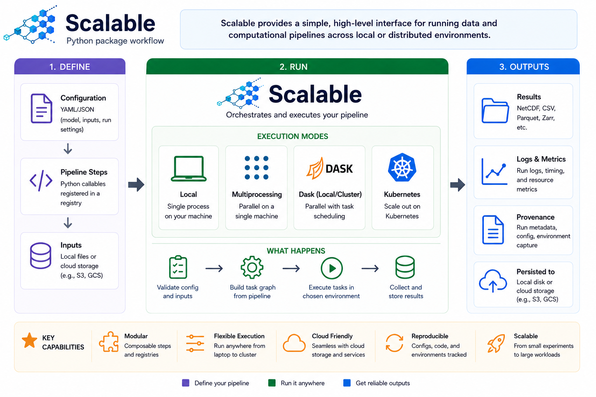

.. Scalable documentation master file, created by
   sphinx-quickstart on Thu Aug 22 10:55:42 2024.
   You can adapt this file completely to your liking, but it should at least
   contain the root `toctree` directive.

Scalable Documentation
======================

Scalable is a Python library for orchestrating multi-step workflows on HPC
systems with minimal manual overhead. It combines Dask-based task execution,
scheduler-aware worker provisioning, and optional containerized runtimes so
workloads can run reproducibly across heterogeneous environments.

The diagram below shows the high-level architecture.

Scalable is a strong fit when your project needs one or more of the following:

* Long-running or resource-intensive workflows on shared HPC infrastructure.
* Pipeline-style execution where outputs from one stage feed downstream stages.
* Automatic or programmatic scaling of workers and hardware allocations.

Scalable supports running functions in distinct software environments via
container images. A multi-stage Dockerfile can define multiple worker profiles,
each with different dependencies, models, or tools, and worker counts can be
managed per profile when scaling out a cluster.

Contents
--------

.. toctree::
   :caption: Getting Started
   :maxdepth: 1

   getting_started
   license
   how_to_contribute

.. _api_section:

.. toctree::
   :caption: API
   :maxdepth: 1

   workers
   manifest
   providers
   telemetry
   advising
   caching
   functions

.. _how_tos_section:

.. toctree::
   :caption: How-tos
   :maxdepth: 1

   cache_hash
   container
   rpy2

.. _demos_section:

.. toctree::
   :caption: Demos
   :maxdepth: 1

   demo
   helps_demo

.. _common_issues_section:

.. toctree::
   :caption: Common Issues
   :maxdepth: 1

   issues
