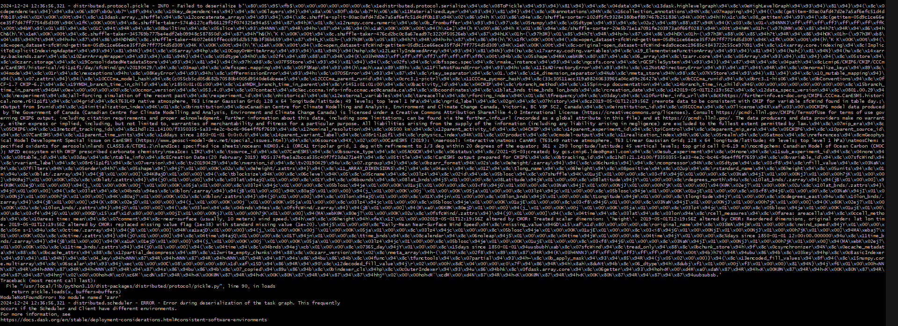

Common Issues
=============

Pickling Error
--------------

This page outlines some of the common problems and caveats still present in 
the current version of scalable. While some of them are being worked on, others 
may be inherent to dask. 

To start with, let's look at something which we is already used in the 
:doc:`demo`:

.. code-block:: python

    @cacheable
    def run_stitches(recipe, output_path):
        import stitches
        import dask
        ## The dask config is set to synchronous to avoid any issues. 
        with dask.config.set(scheduler="synchronous"):
            outputs = stitches.gridded_stitching(output_path, recipe)
        return outputs

The above code is a simple function that runs 
`stitches <https://github.com/JGCRI/stitches>`_. The primary code line which 
runs sitches is ran under the dask.config.set context manager. The scheduler is 
set to synchronous in this case. The alternative would've been to write this 
function as:

.. code-block:: python

    @cacheable
    def run_stitches(recipe, output_path):
        import stitches
        outputs = stitches.gridded_stitching(output_path, recipe)
        return outputs

The above code should've worked well. However, the following error is thrown 
when the function is called with a dask client (scalable):

The error thrown above is a pickling error. This happens because dask tries to 
use multiple different workers to make the dask task graph. However, since our 
workers have different environments, the `run_stitches` task cannot be pickled 
by other workers. Therefore, whenever this issue is encountered, it is 
recommended to set the scheduler to be "synchronous" which means that it will 
pickle the task and run it on the same specified worker. 

Deadlocks and Stuck Workers
---------------------------

Another issue that can occasionally be encountered is deadlocks. It is possible 
that a worker can get stuck processing a function forever. This issue is quite 
subtle to debug as the worker can just genuinely be processing instead of being 
stuck. The best way to recognize this issue is if the function is taking a lot 
longer than expected. The most common cause of this issue is a deadlock. And 
the most common cause of a deadlock is assigning multiple CPUs to a container 
which is only running functions which use a single CPU. In other words, 
reserving multiple CPUs for single-threaded functions can cause deadlocks. 

When multiple CPUs are assigned to a container in the following way:

.. code-block:: python

    cluster.add_container(tag="container_tag", cpus=2, memory="50G", dirs={"/qfs":"/qfs", "/rcfs":"/rcfs"})

The scalable backend assigns a threadpool with 2 threads to any worker with the 
same tag as the container. However, if the functions running on the worker are 
single-threaded, there could be two instances of the function assigned to the 
worker which can occasionally cause a deadlock. To prevent this, please ensure 
that the correct amount of CPUs are assigned to the container. 

General Errors
--------------

There can also be just general errors which are either thrown by dask or are 
manifested in the form of workers which didn't connect or slurm errors. There 
are mechanisms within Scalable which should warn about any workers which 
couldn't connect for whatever reason. However, as a rule of thumb, restarting 
the cluster and the workflow is the best way to resolve any one time errors. 
HPC systems can be unreliable and throw unknown errors sometimes. As always, 
please feel free to open an issue 
`here <https://github.com/JGCRI/scalable/issues>`_ for any persistent issues. 